## 基于SpringBoot+Vue3+UniApp实现的旅游系统


> 获取sql请联系作者QQ：2791265715


### 一、相关技术

**SpringBoot** 、**mybatis-plus** 、**mysql** 、**redis**、**vue**、**antdesignvue**、**uniapp**


### 二、安装

安装所需运行环境：mysql8、redis、JDK8+、nodejs18.x+、maven3.6+

#### 前端工程

使用 vscode 或者 webstorm 打开`tourism-admin` 前端工程，执行：

```
npm run install
```

或者

```
yarn install
```

#### 后端工程

使用 IDEA 打开`tourism_api` 后端工程，并配置Maven、JDK、Redis、MySQL8环境。

#### 小程序

使用HBuilderx打开`tourism_weapp` 文件并等待依赖安装完成，点击运行，使用微信开发者工具预览


### 三、提示 

系统运行截图，请看`**系统截图**`文件夹


### 四、说明

**功能完整：所见即所有，有些功能作者没有添加数据，可自行添加**


### 五、运行截图

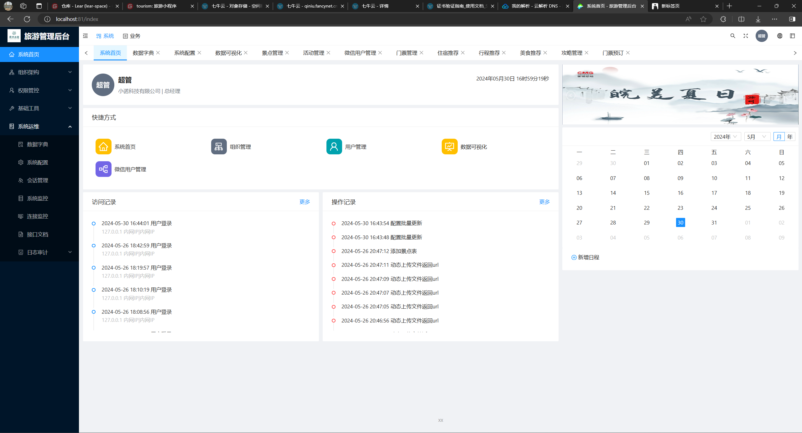

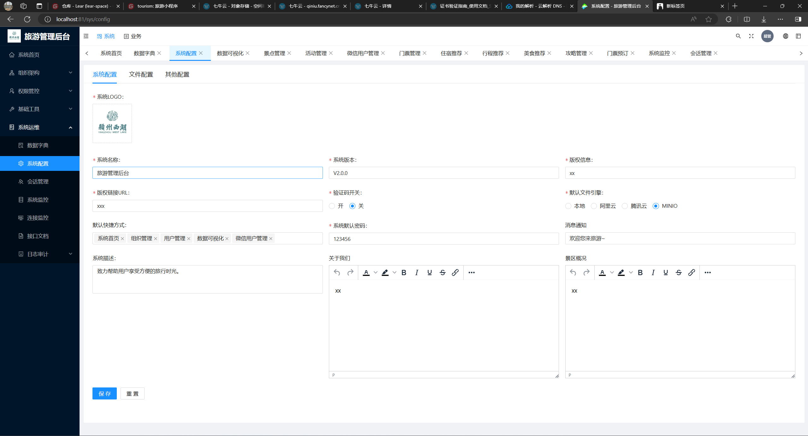

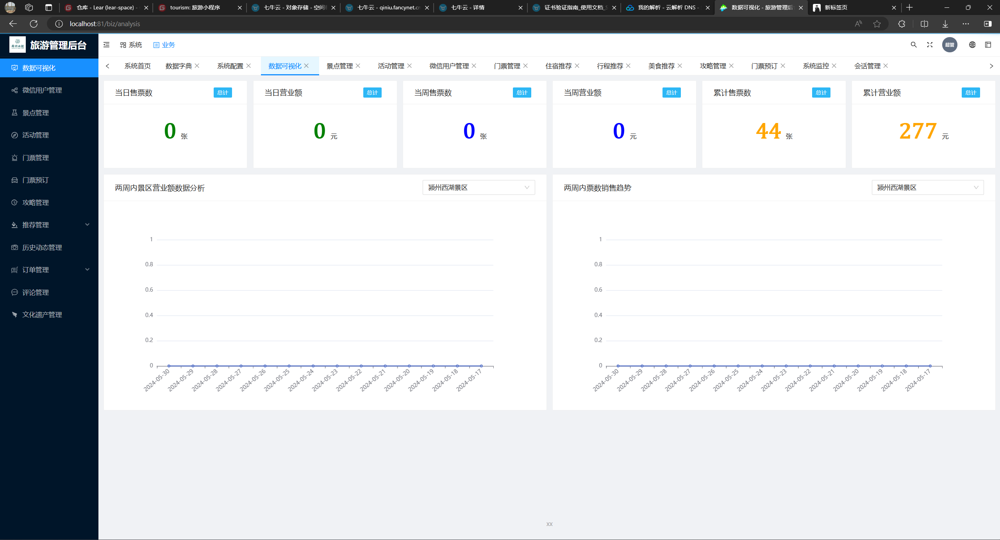

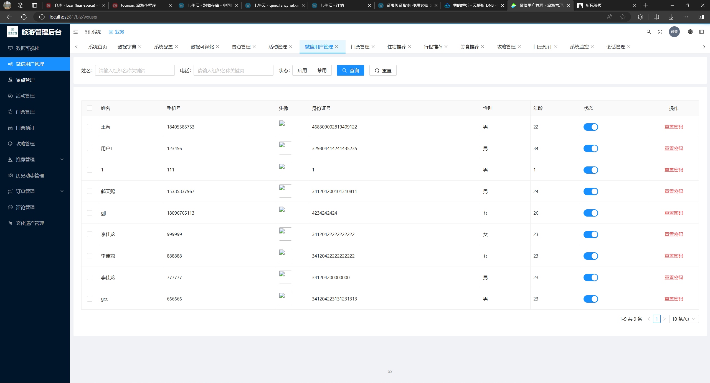

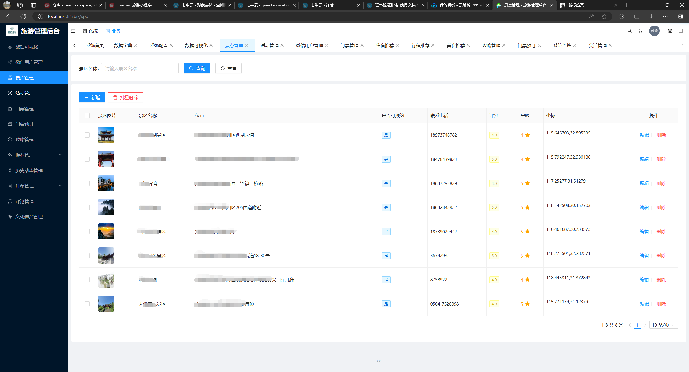

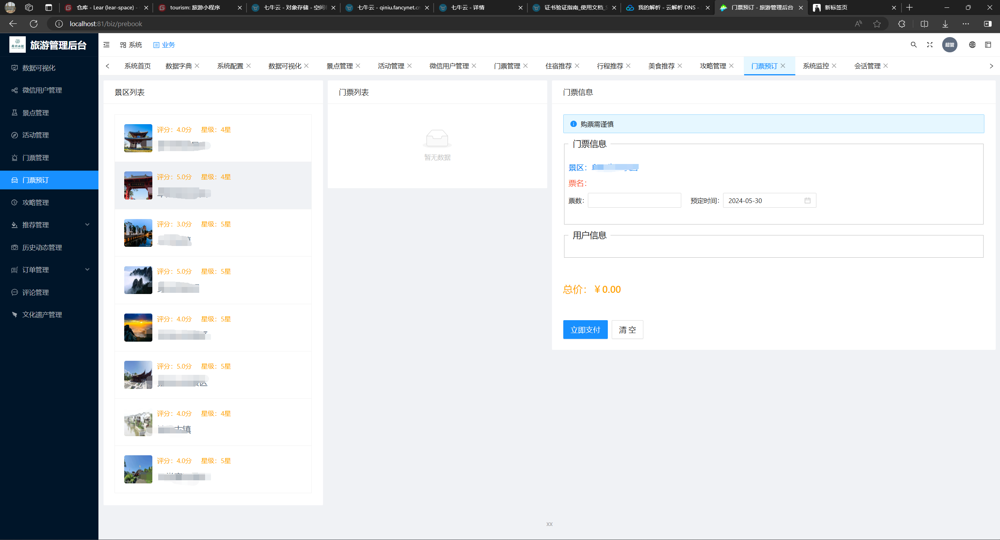

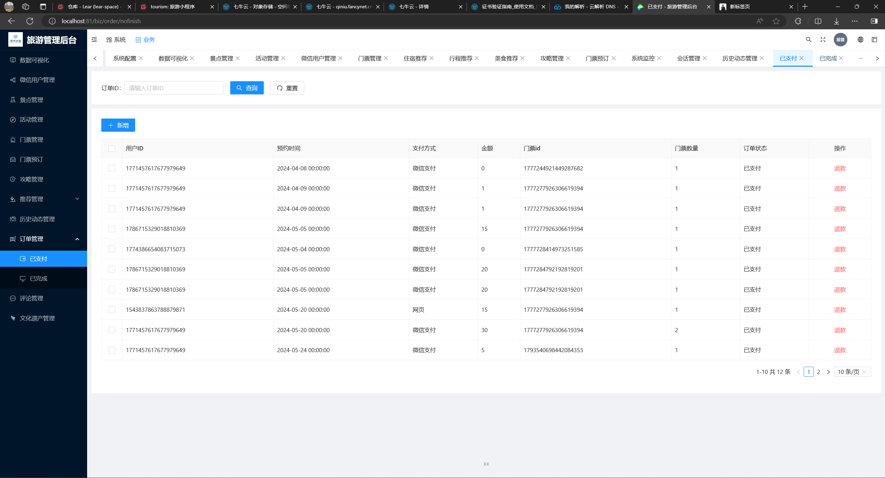

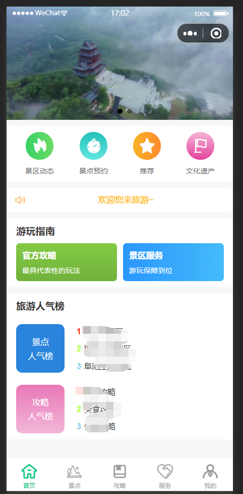

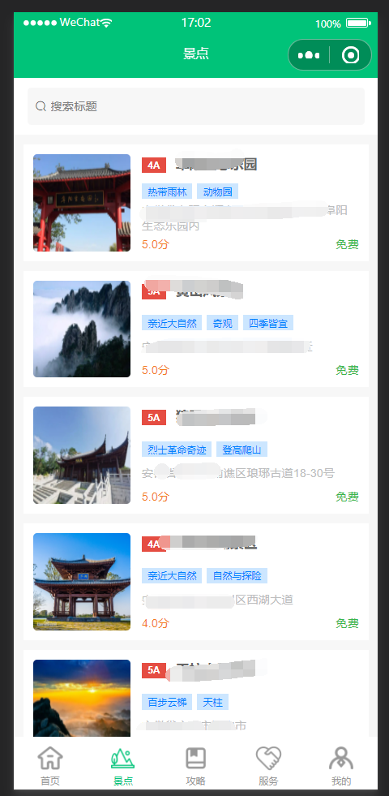


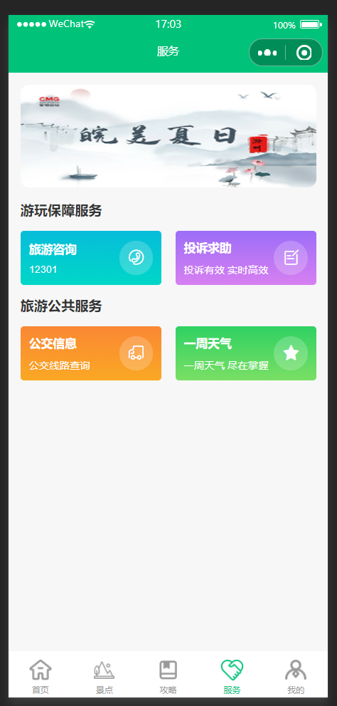

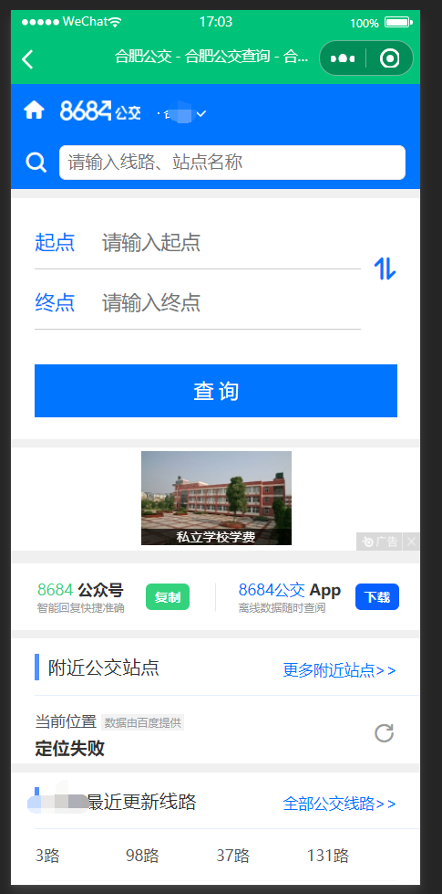

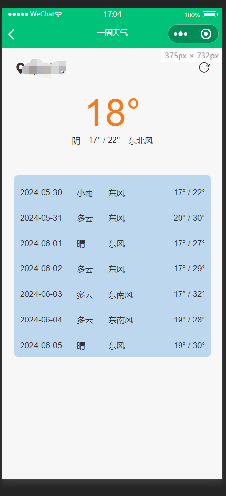

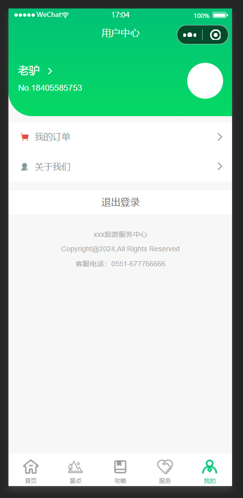


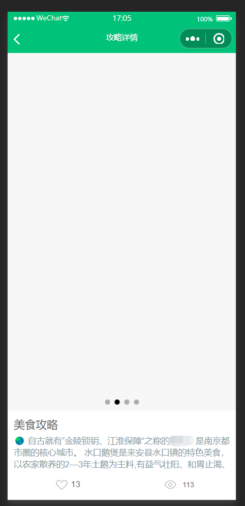
